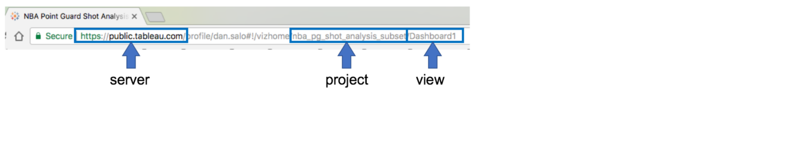
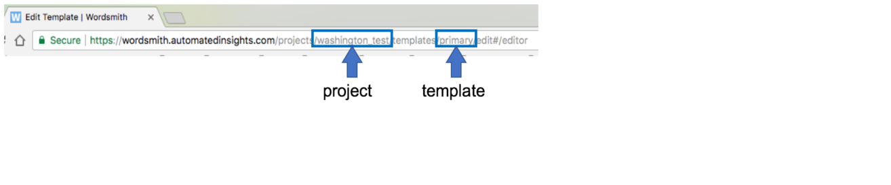

# Tableau + Wordsmith SDK for Python

**Note**: This code repository utilizes the [Tableau JS API](https://onlinehelp.tableau.com/current/api/js_api/en-us/JavaScriptAPI/js_api.htm).
The Tableau Extensions API will be incorporated when it is officially released.

## Introduction

### Wordsmith
[Wordsmith](https://automatedinsights.com/wordsmith) makes it easy to generate thousands of stories, reports, and articles in the time it takes to write just one.
Wordsmith is a natural language generation tool that enables users to turn data into text using dynamic templates.
The platform is easy to learn, and powerful enough to make each piece of content totally unique.

The [Wordsmith API](http://wordsmith.readme.io/v1.5/docs) allows developers to generate new content using the Templates created in the Wordsmith web app by users at your company.
Developers can use the API to send new data which will trigger the generation of new text content.
You have complete control over when you generate and use the content.

### Tableau
[Tableau](https://www.tableau.com/about) offers a variety of tools, such as their Desktop application and their Server software,
which enable people to tell a story by generating compelling, data-driven visualizations.
These interactive visualizations help to transform large amounts of data into unique insights that can drive business and innovation.
Tableau visualizations are created in the Desktop application with drag-and-drop functionality and are hosted on a Server
with the click of a button.

The [Tableau Javascript API](https://onlinehelp.tableau.com/current/api/js_api/en-us/JavaScriptAPI/js_api.htm) allows third-party
software to interact with a visualization that is hosted on a Tableau Server in a simple and secure way. This API allows
users to generate descriptive narrative alongside visualizations by integrating Wordsmith and Tableau; this code repository
offers a robust starting point for such an integration.

## Installation

### Prerequisites

 1. Your Tableau dashboard hosted on [Tableau Server](https://www.tableau.com/products/server), [Tableau Online](https://www.tableau.com/products/cloud-bi?ab=1), or [Tableau Public](https://public.tableau.com/en-us/s/)
 2. [Python](https://www.python.org/downloads/) for writing calculations.
 3. [Node.Js](https://nodejs.org/en/download/) for editing the config file and changing the Javascript files (if necessary).
 4. Developer-savvy and familiarity with the Terminal or the Command Line interface.

### Installation
Open up Terminal or the Command line and navigate to where you would like to download this code repository.
Then execute the following commands:

 - Run `git clone https://github.com/ai-invent/tableau-wordsmith-python-sdk.git` to download the code.
 - Run `cd tableau-wordsmith-python-sdk` to navigate into the folder.
 - Run `npm install` to install Node.js packages.
 - Run `pip install -r requirements.txt` to install Python packages.
 - Run `python main.py` to launch the Flask app.
 - Navigate to `127.0.0.1:5050` to view the Wordsmith + Tableau integration.

### config.yml File

#### `tableau`
  - **server**: Server url hosting dashboard. Include trailing slash.
  - **project**: Project name from URL. See image below for more detail.
  - **view**: Dashboard name from URL. See image below for more detail.
  - **changes**: Dictates upon which interactions with the viz the narrative will refresh.

    ##### Tableau Configuration Help:
    

#### `wordsmith`
  - **api_key**: Wordsmith API Key. This is used for authentication into the Extensions app as well.
  - **project**: Project Slug. This is used for authentication into the Extensions app as well.
  - **template**: Template Slug. This is used for authentication into the Extensions app as well.

    ##### Wordsmith Configuration Help:
    

#### `html`
  - **title**: The page title of the web app.
  - **file**: The choice of HTML page for the web app from the `templates/` folder.

#### `dev`
This is a boolean flag that when set to `True`, will generate a `settings.p` file with all of the data scraped
from the Tableau dashboard and a `ws_data.csv` file with all of the calcs ready for upload to a
Wordsmith project.

### Styling
Browse `templates/` for various HTML formattings. `index.html` and `table.html` are the current offerings, but
others can be added and selected in `config.yml`. The user can also edit `static/css/main.css` to change the
stylings on the web page.

### Calculations
Fill out `app/model.py` with Python calculations to generate Wordsmith-ready data. Set `dev` to `True` to 1) save sample data from the dashboard in Python's pickle format
 and 2) save sample WS-ready data generated by calcs as a CSV, which can be uploaded to a Wordsmith project.

### Docker (optional)
A `Dockerfile` is included in order to facilitate remote hosting of the web app. Once you have downloaded
[Docker](https://www.docker.com/get-docker), open the Terminal or Command line and execute the following commands:

   - Run `docker build -t tableau-wordsmith .` to create a Docker image.
   - Run `docker run -d -p 80:5050 tableau-wordsmith` to run the image locally and ensure everything is working
   properly. You can now run this container on any web server machine with Docker running on it.
